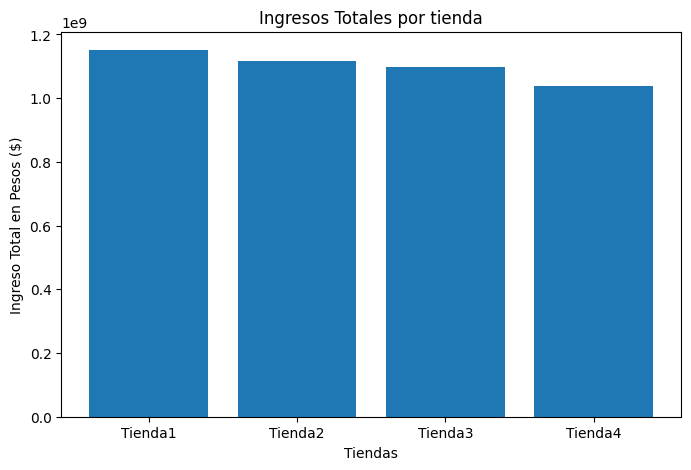

# Proyecto de análisis de datos AluraStore

### Descripción general

Este proyecto nace de una actividad denominada challenge, la cual forma parte del programa educativo "Oracle Next Eductaion" impartido por Alura Latam.
Se presenta un caso en el que Sr. Juan necesita saber que tienda (de cuatro) tiene el menor rendimiento para poder venderla, y así invertir en otro negocio.

Para este análisis nos entregaron cuatro data set con información relevante de las cuatro tiendas, por lo cuál se nos solicita incluir en el mismo:

* Análisis de facturación.
* Ventas por categorías.
* Calificación promedio de la tienda.
* Productos más y menos vendidos.
* Envío promedio por tienda.

### El análisis se realizó de la siguinete manera:

- Ejecutar las celdas de carga de los datos en archivos .csv (Alura entregó los datos limpios para que nos concentraramos en el análisis).
- Calculamos métricas importantes: ingresos totales, valoración promedio de las tiendas, costos de envíos.
- Identificar los productos más y menos vendidos.
- Generar las gráficas correspondientes
- Elaborar un informe tomando en cuento los resultados de los análisis

### Resúmen de resultados

Considerando que el objetivo es identificar la operación menos eficiente, el menor volumen de negocio reflejado en el bajo ingreso total de la tienda 4, a pesar de sus puntos positivos en logística y satisfacción relativa, la posiciona como la candidata más lógica para la venta al presentar el menor retorno financiero general (para una versión más detallada, por favor ingrese al notebook de Google Colab en este repositorio).

### Accediendo al análisis

El análisi fué elaborado en un archivo de Google Colab, por lo que debes realizar lo siguiente para acceder:

- Debes hacer clic en el archivo `AluraStoreLatam.ipynb` dentro del repositorio
- En la vista de archivo de GitHub, busca y haz clic en el botón "Open in Colab" (Abrir en Colab). Esto abrirá el cuaderno directamente en Google Colab.
- Dentro del archivo de Google colab podrás leer el análisis y su justificacion, ver el codigo y ejecutarlo, visulizar las gráficas.

  **Nota:** puedes tambien descargar el archvio en local y subirlo a tu cuaderno de trabajo en Google Colab.

### Tecnologías utilizadas

- Python
- Pandas (para manipulación y análisis de datos)
- Matplotlib (para visualización de datos)
- Google Colab (entorno de desarrollo)

### Autor

Artax2000 

